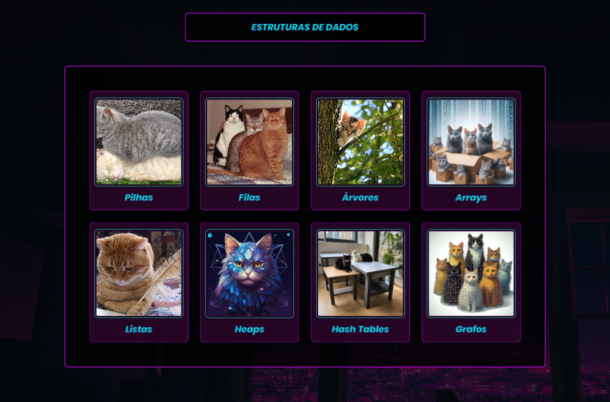

  

# LogiCats 
O LogiCats é um projeto educacional que utiliza ilustrações de gatos para ensinar de forma teórica as principais estruturas de dados. Seu objetivo é tornar o aprendizado desses conceitos complexos mais acessível e interessante, transformando a jornada do aprendizado em uma dança de compreensão felina.

O nome "LogiCats" vem de "logi", que representa a lógica de programação, e "cats", que vem de gatos. Juntos, eles simbolizam a fusão entre a lógica da programação e algoritmo e a representação divertida e cativante dos gatos, criando uma abordagem única e envolvente para o ensino de estruturas de dados.

  

# Por que gatos?
Os gatos são conhecidos por sua curiosidade, agilidade e capacidade de resolver problemas de forma inteligente. Essas características fazem deles excelentes representantes das estruturas de dados, que também requerem pensamento lógico e habilidade para lidar com informações de forma eficiente. Além disso, a presença dos gatos torna o aprendizado mais leve e divertido, proporcionando uma experiência educacional mais agradável.

## Conclusão do projeto

O LogiCats não é apenas um projeto sobre estruturas de dados, é uma jornada de descoberta e aprendizado que visa tornar conceitos complexos acessíveis e interessantes. Ao utilizar ilustrações de gatos e suas interações para representar as estruturas de dados, o LogiCats transforma o aprendizado em uma dança de compreensão felina, onde cada movimento dos gatinhos reflete um conceito importante. Nosso objetivo é proporcionar uma experiência educacional envolvente e memorável, onde os estudantes não apenas aprendem sobre estruturas de dados, mas também desenvolvem habilidades de pensamento lógico, resolução de problemas e abstração. Queremos inspirar a curiosidade e a criatividade, incentivando os estudantes a explorar e experimentar, assim como os gatos fazem em seu ambiente. Esperamos que o LogiCats não seja apenas uma ferramenta de ensino, mas sim um companheiro de aprendizado que faça parte da jornada educacional de cada estudante, deixando uma marca duradoura em seu entendimento e apreciação das estruturas de dados.

## Equipe: 
- [Vinicius Samuel](https://www.github.com/vini-21samuel)
- [Lucas Melo](https://www.github.com/lukemew)
- [Expedito Farias](https://www.github.com/ExpeditoFarias)
- [Wesley Moreira](https://www.github.com/wesle-yey)
- [Pedro Henrique](https://www.github.com/Pedroghb)
